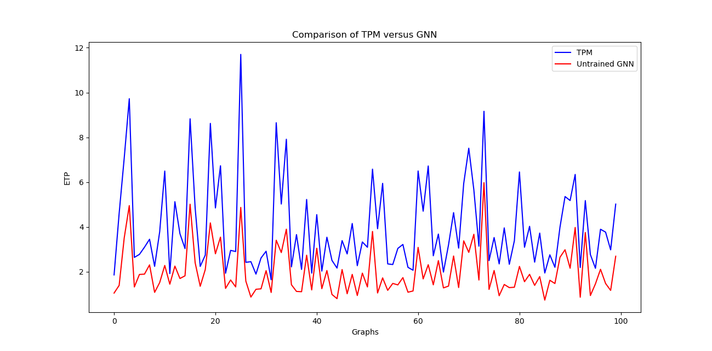

# graph_neural_nets

This is an attempt to assign coodinates to nodes within a Wireless Sensor Network (WSN) using Graph Convolutional Network (GCN).
 
**Input:** Virtual Coordinates, Adjacency Matrix of a Graph
 
**Output:** Topological Coordinates of a Graph
 

1. **Requirements:** To install the software requirements, run `pip3 install -r wsn/requirements.txt`
2. **How to execute:** The python program can be run from the current folder as : `python3 wsn/hidden_2_relu_g_200.py` 
2. `*.index` and `*.meta` files are tensorflow checkpoint files. They can be used to perform inference or continue training from the current state
instead of starting fresh from scratch.
3. The architecture of the model can be fund at `wsn/model_arch.png`
4. `wsn/learning_curves/` folder contains the matplotlib plots of cost-histories. The cost-histories themselves can be found at `wsn/cost_histories/` 
5. `wsn/etp.py` : This file contains the calculation of ETP cost as defined by Dhanapala et al, IEEE/ACM TON, 2014.
6. `wsn/calculate_virtual_coordinates.py` : This file contains the code to generate a geographic coordinates initially, then generates virtual cooadinates through flooding of the network.

The below graph represents the performance of an untrained GNN versus the TPM algorithm proposed in the paper IEEE/ACM TON paper Dhanapala et al, 2014.

I expect the accuracy will go down with further training of the GNN. But one factor that bothers me is that GNN takes the virtual coordinates matrix(X) as well as the adjacency matrix(Adj) as the input. The use of Adjacency matrix kind of undermines the point of GNNs because we can apply deterministic algorithms like Bellman Ford or the optimised versions. But GNNs are definitely better than those in terms of lower latency for computation time as well as lower memory consumption to store the weights of the network.

## References:
1. Kipf, Thomas N., and Max Welling. "Semi-supervised classification with graph convolutional networks." 
arXiv preprint arXiv:1609.02907 (2016).
